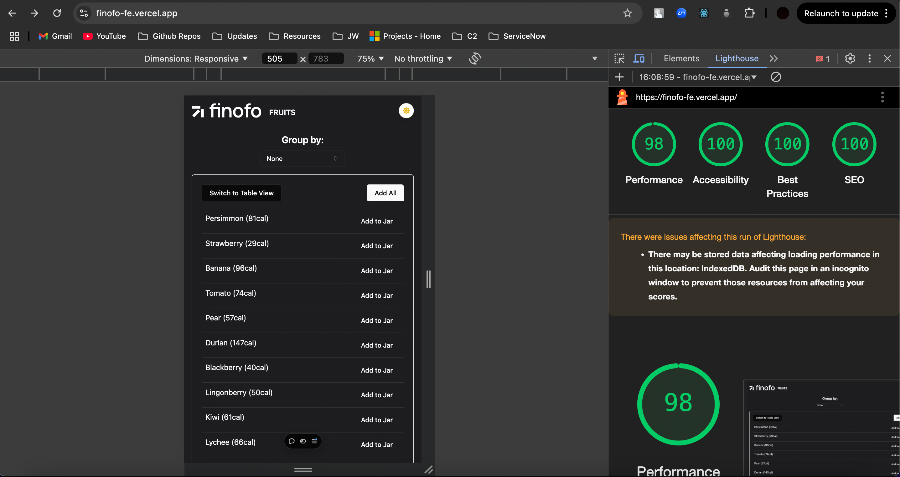

### Task Description

Create a basic application using React and TypeScript to display a list of fruits. The application should fetch data from an external API and display the fruits grouped by a specified field.

- Hosted on: https://finofo-fe.vercel.app
- Repo: https://github.com/bazybones/finofo_fe

## Technologies Used
 - React with TypeScript (Vite)
 - Axios and custom React hook for data fetching
 - shadcn UI and tailwindCSS for styling
 - Chart.js for pie chart visualization
 - mockapi.io for API mocking due to CORS issues, tried bypassing it with proxy, but it did not work in dev, only on local machine

 ## Performance Benchmark

### Requirements

1. **Data Fetching**
  - Due to CORS issues with the provided API endpoint, I hosted a mock version on mockapi.io with the same data to ensure functionality across both local and deployed environments.
  - Endpoint: https://66de3f43de4426916ee0b58f.mockapi.io/api/fruits
  - Fetching Library: Used axios and inbuilt state management for this project, however, I've worked with Redux Toolkit and Tanstack Query for larger apps for state management and api integration in past.

2. **Layout**
   - The page should was divided into two sections:
     - Created a reusable component Layout.tsx,for split screen components. **Left Section:** Displays the list of fruits.
      **Right Section:** Displays the jar with selected fruits and pie chart.

3. **Group By Functionality**
  - Grouping Logic: The GroupBy component provides a Select dropdown to allow users to group fruits by "None," "Family," "Order," or "Genus." The selected option dynamically updates the list display by passing the grouping type to the FruitList component.
  - Dynamic List Display: Based on the groupBy state, the FruitList component organizes fruits under collapsible headers derived from the selected grouping attribute. This collapsible structure adapts automatically to the chosen grouping.
  - Data Fetching and Error Handling: The useFetchFruits hook handles the API call, and error and loading states are shown using Skeleton loaders and Alerts. The ScrollArea component keeps the grouped list view scrollable within a fixed height.

4. **Fruit List**
  - Dual View Switching: A toggleView function enables switching between "List" and "Table" views. The "List" view displays fruits in the format {fruit name} ({calories}), while the "Table" view includes detailed columns for each fruit attribute.
  - Group Actions and Layout: In "List" view, fruits are grouped under collapsible headers based on the selected groupBy attribute, with an "Add All" button at the group level, allowing quick addition of all fruits in a group to the jar.
  - Add to Jar Buttons: Each fruit has an "Add" button, enabling individual additions, and a top-level "Add All" button in both views, allowing bulk addition of all listed fruits to the jar, enhancing usability.

6. **Jar Functionality**
  - Total Calorie Calculation and Removal Actions: The Jar component calculates the total calories based on the quantity of each fruit in the jar. Users can remove individual fruits or clear the entire jar with a "Remove All" button, improving calorie tracking and item management.
  - Pie Chart Visualization: Using react-chartjs-2, a pie chart displays the calorie distribution of each fruit type in the jar, with colors assigned dynamically to each fruit based on its name. This visual aid helps users understand the calorie composition at a glance.
  - Scrollable Fruit List: Inside a scrollable area, the jar displays added fruits with their quantities, calorie counts, and an option to remove each fruit individually. This organized layout makes it easy for users to review or adjust items in the jar.
